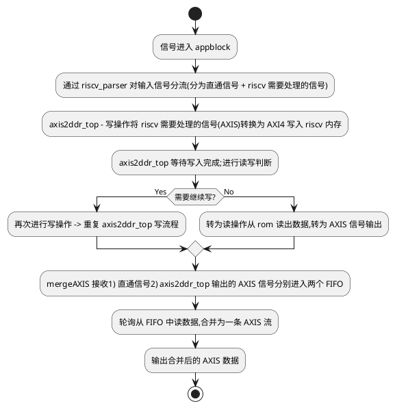

---
tags:
  - ysyx
status: Published
Publisher: CHEN
category: ysyx
NotionID-t: 154f2c56-24c9-81f2-bb99-e2fd06ff36d6
link-t: https://www.notion.so/2-axis-to-axi4-154f2c5624c981f2bb99e2fd06ff36d6
---
# 输入路径
1. axis2ddr_top（S_AXIS_TDATA）->u_axis_salve2fifo(S_AXIS_TDATA),fifo输出为fwr_dat->u_forwardfifo(wr_din),输出为frd_din->u_axi_full_core(frd_din)
2. 在axi_full_core代码中
# axi full core
输入输出主要是三部分： 
1. AXI-FULL master port（输出）用于memory输出 ；
2. forward FIFO read interface（输入）主要是输入数据 ；
3. backward FIFO write interface是向后的输出数据
状态机参数如下所示

``` verilog
    parameter [3:0] IDLE_W = 4'b0000, // This state initiates AXI4Lite transaction

            // after the state machine changes state to INIT_WRITE

            // when there is 0 to 1 transition on INIT_AXI_TXN

        INIT_WRITE   = 4'b0001, // This state initializes write transaction,

            // once writes are done, the state machine

            // changes state to INIT_READ

        INIT_READ = 4'b0010, // This state initializes read transaction

            // once reads are done, the state machine

            // changes state to INIT_COMPARE

        INIT_COMPARE = 4'b0011, // This state issues the status of comparison

            // of the written data with the read data  

        IDLE_RW = 4'b0100;
      ```
 和pkt filter不同，上面的注释已经说明了，这个状态转换不会回到idle状态待命，而是顺序流转
# 赋值
挑一些重要的讲，M_AXI_AWADDR是基准地址（这个是传入的参数）+axiawaddr（随状态机进行流转）
 ``` verilog
     // I/O Connections assignments
    //I/O Connections. Write Address (AW)
    assign M_AXI_AWID   = 'b0;

    //The AXI address is a concatenation of the target base address + active offset range

    assign M_AXI_AWADDR = C_M_TARGET_SLAVE_BASE_ADDR + axi_awaddr;

    //Burst LENgth is number of transaction beats, minus 1

    assign M_AXI_AWLEN  = C_M_AXI_BURST_LEN - 1;

    //Size should be C_M_AXI_DATA_WIDTH, in 2^SIZE bytes, otherwise narrow bursts are used

    assign M_AXI_AWSIZE = clogb2((C_M_AXI_DATA_WIDTH/8)-1);

    //INCR burst type is usually used, except for keyhole bursts

    assign M_AXI_AWBURST    = 2'b01;

    assign M_AXI_AWLOCK = 1'b0;

    //Update value to 4'b0011 if coherent accesses to be used via the Zynq ACP port. Not Allocated, Modifiable, not Bufferable. Not Bufferable since this example is meant to test memory, not intermediate cache.

    assign M_AXI_AWCACHE    = 4'b0010;

    assign M_AXI_AWPROT = 3'h0;

    assign M_AXI_AWQOS  = 4'h0;

    assign M_AXI_AWUSER = 'b1;

    assign M_AXI_AWVALID    = axi_awvalid;

    //Write Data(W)

    assign M_AXI_WDATA  = axi_wdata;

    //All bursts are complete and aligned in this example

    assign M_AXI_WSTRB  = {(C_M_AXI_DATA_WIDTH/8){1'b1}};

    assign M_AXI_WLAST  = axi_wlast;

    assign M_AXI_WUSER  = 'b0;

    assign M_AXI_WVALID = axi_wvalid;

    //Write Response (B)

    assign M_AXI_BREADY = axi_bready;

    //Read Address (AR)

    assign M_AXI_ARID   = 'b0;

    assign M_AXI_ARADDR = C_M_TARGET_SLAVE_BASE_ADDR + axi_araddr;

    //Burst LENgth is number of transaction beats, minus 1

    assign M_AXI_ARLEN  = C_M_AXI_BURST_LEN - 1;

    //Size should be C_M_AXI_DATA_WIDTH, in 2^n bytes, otherwise narrow bursts are used

    assign M_AXI_ARSIZE = clogb2((C_M_AXI_DATA_WIDTH/8)-1);

    //INCR burst type is usually used, except for keyhole bursts

    assign M_AXI_ARBURST    = 2'b01;

    assign M_AXI_ARLOCK = 1'b0;

    //Update value to 4'b0011 if coherent accesses to be used via the Zynq ACP port. Not Allocated, Modifiable, not Bufferable. Not Bufferable since this example is meant to test memory, not intermediate cache.

    assign M_AXI_ARCACHE    = 4'b0010;

    assign M_AXI_ARPROT = 3'h0;

    assign M_AXI_ARQOS  = 4'h0;

    assign M_AXI_ARUSER = 'b1;

    assign M_AXI_ARVALID    = axi_arvalid;

    //Read and Read Response (R)

    assign M_AXI_RREADY = axi_rready;

    //Example design I/O

    assign TXN_DONE = compare_done;

    //Burst size in bytes

    assign burst_size_bytes = C_M_AXI_BURST_LEN * C_M_AXI_DATA_WIDTH/8;

    assign init_txn_pulse   = (!init_txn_ff2) && init_txn_ff;
```

# 延迟一拍方便开启事务
``` verilog
  

    //Generate a pulse to initiate AXI transaction.

    always @(posedge M_AXI_ACLK)                                              

      begin                                                                        

        // Initiates AXI transaction delay    

        if (M_AXI_ARESETN == 0 )                                                  

          begin                                                                    

            init_txn_ff <= 1'b0;                                                  

            init_txn_ff2 <= 1'b0;                                                  

          end                                                                              

        else                                                                      

          begin  

            init_txn_ff <= INIT_AXI_TXN;

            init_txn_ff2 <= init_txn_ff;                                                                

          end                                                                      

      end
```


# 写地址讲解
注释部分
``` verilog 
//--------------------
//Write Address Channel
//--------------------

// The purpose of the write address channel is to request the address and 
// command information for the entire transaction.  It is a single beat
// of information.

// 写地址通道的目的是请求整个事务的地址和命令信息。它是一个单次打击的信息。

// The AXI4 Write address channel in this example will continue to initiate
// write commands as fast as it is allowed by the slave/interconnect.
// 在这个例子中，AXI4写地址通道将尽可能快地发起写命令，只要被从设备/互连允许。

// The address will be incremented on each accepted address transaction,
// by burst_size_byte to point to the next address. 
// 每个被接受的地址事务后，地址将增加burst_size_byte，以指向下一个地址。
```

``` verilog 
always @(posedge M_AXI_ACLK) begin                                                                     
    if (M_AXI_ARESETN == 0 || init_txn_pulse == 1'b1 ) begin                                                            
        axi_awvalid <= 1'b0;                                               
    end                                                              
    // If previously not valid , start next transaction                
    else if (~axi_awvalid && start_single_burst_write) begin                                                            
        axi_awvalid <= 1'b1;                                               
    end                                                              
    /* Once asserted, VALIDs cannot be deasserted, so axi_awvalid      
    must wait until transaction is accepted */                         
    else if (M_AXI_AWREADY && axi_awvalid) begin                                                            
        axi_awvalid <= 1'b0;                                               
    end                                                              
    else begin                                                             
        axi_awvalid <= axi_awvalid;  
    end                                    
end                                                                

// 这部分代码是一个时钟敏感的always块，它控制axi_awvalid信号。
// axi_awvalid信号表示写地址通道是否有有效的地址和控制信息要发送。
// 当复位信号M_AXI_ARESETN为0或者初始化事务脉冲init_txn_pulse为1时，axi_awvalid被设置为0。
// 如果axi_awvalid之前无效，并且start_single_burst_write为真，则开始下一个事务，axi_awvalid被设置为1。
// 一旦axi_awvalid被断言，它不能被取消断言，所以必须等到事务被接受（M_AXI_AWREADY和axi_awvalid都为真）后，axi_awvalid才能被设置为0。
```

``` verilog 
                                                                                                                
// Next address after AWREADY indicates previous address acceptance    
always @(posedge M_AXI_ACLK) begin                                                                
    if (M_AXI_ARESETN == 0 || init_txn_pulse == 1'b1) begin                                                            
        axi_awaddr <= 1'b0;                                              
    end                                                              
    else if (M_AXI_AWREADY && axi_awvalid) begin                                                            
        axi_awaddr <= (axi_awaddr >= (PIXELS_VERTICAL * PIXELS_HORIZONTAL * FRAME_DELAY - C_M_AXI_BURST_LEN * (C_M_AXI_DATA_WIDTH / 8)) - 1) ? 0 : (axi_awaddr + burst_size_bytes);                   
    end                                                              
    else begin                                                           
        axi_awaddr <= axi_awaddr;
    end                                        
end        
// 这部分代码是另一个时钟敏感的always块，它控制axi_awaddr信号。
// axi_awaddr信号存储当前的写事务地址。
// 当复位信号M_AXI_ARESETN为0或者初始化事务脉冲init_txn_pulse为1时，axi_awaddr被设置为0。
// 如果M_AXI_AWREADY和axi_awvalid都为真，表示前一个地址被接受，axi_awaddr将增加burst_size_bytes，指向下一个地址。
// 如果增加后的地址超过了最大值（由PIXELS_VERTICAL、PIXELS_HORIZONTAL、FRAME_DELAY、C_M_AXI_BURST_LEN和C_M_AXI_DATA_WIDTH定义），则axi_awaddr重置为0。
// 如果M_AXI_AWREADY和axi_awvalid不为真，axi_awaddr保持不变。
```

在这段代码中，`burst_size_byte` 应该是一个参数或变量，它代表了一个突发（burst）事务中数据字节的大小。在AXI协议中，突发事务可以是固定长度（FIXED）、增量长度（INCR）或根据传输的数据长度来定。`burst_size_byte` 通常用于增量突发事务，它定义了每次地址增加时的步长，即每次数据传输后地址应该增加多少字节来指向下一个数据块。

在AXI协议中，`burst_size` 可以是1、2、4、8、16、32、64、128或256个字节，这取决于具体的AXI接口实现和系统设计的需求。`burst_size_byte` 应该是与`burst_size`相对应的值，即`burst_size`乘以数据宽度（`C_M_AXI_DATA_WIDTH / 8`）除以8（因为1字节=8位）。

例如，如果`C_M_AXI_DATA_WIDTH` 是32位（即4字节），而`burst_size` 是4，那么`burst_size_byte` 就是4 * 4 = 16字节。这意味着每次地址被接受后，地址将增加16字节，指向下一个数据块的起始位置。

在代码中，`burst_size_byte` 没有被直接定义，它可能是在代码的其他部分或者作为一个参数传递给这段代码的模块的。这个值对于正确地控制地址的增量和突发事务的执行至关重要。
## axi data write
这段代码是Verilog代码，用于描述AXI4写数据通道（Write Data Channel）的行为。写数据通道负责将数据发送到从设备。以下是对代码的逐行解释：

```verilog
//--------------------
//Write Data Channel
//--------------------

//The write data will continually try to push write data across the interface.
//写数据将不断尝试将数据推送到接口上。

//The amount of data accepted will depend on the AXI slave and the AXI
//Interconnect settings, such as if there are FIFOs enabled in interconnect.
//接受的数据量将取决于AXI从设备和AXI互连设置，例如互连中是否启用了FIFO。

//Note that there is no explicit timing relationship to the write address channel.
//注意，与写地址通道没有明确的时间关系。

//The write channel has its own throttling flag, separate from the AW channel.
//写通道有自己的节流标志，与AW通道分开。

//Synchronization between the channels must be determined by the user.
//通道之间的同步必须由用户确定。

//The simpliest but lowest performance would be to only issue one address write
//and write data burst at a time.
//最简单的但性能最低的做法是一次只发出一个地址写和写数据突发。

//In this example they are kept in sync by using the same address increment
//and burst sizes. Then the AW and W channels have their transactions measured
//with threshold counters as part of the user logic, to make sure neither 
//channel gets too far ahead of each other.
//在这个例子中，它们通过使用相同的地址增量和突发大小来保持同步。然后AW和W通道的事务用阈值计数器作为用户逻辑的一部分来测量，以确保两个通道都不会领先对方太多。

//Forward movement occurs when the write channel is valid and ready
//当写通道有效且准备就绪时，会发生前进动作。
```

这部分是注释，解释了写数据通道的目的和行为。

```verilog
assign wnext = M_AXI_WREADY & axi_wvalid;                                     
//定义wnext信号，当M_AXI_WREADY（写数据通道准备好接收数据）和axi_wvalid（写数据通道有效）都为真时，wnext为真。
```

```verilog
// WVALID logic, similar to the axi_awvalid always block above                      
always @(posedge M_AXI_ACLK) begin                                                                              
    if (M_AXI_ARESETN == 0 || init_txn_pulse == 1'b1 ) begin                                                                          
        axi_wvalid <= 1'b0;                                                          
    end                                                                            
    // If previously not valid, start next transaction                              
    else if (~axi_wvalid && M_AXI_AWREADY && axi_awvalid) begin                                                                          
        axi_wvalid <= 1'b1;                                                          
    end                                                                            
    /* If WREADY and too many writes, throttle WVALID                               
    Once asserted, VALIDs cannot be deasserted, so WVALID                           
    must wait until burst is complete with WLAST */                                 
    else if (wnext && axi_wlast) begin                                                    
        axi_wvalid <= 1'b0;           
    end                                                
    else begin                                                                            
        axi_wvalid <= axi_wvalid;
    end                                                      
end
//控制axi_wvalid信号的逻辑，类似于上面的axi_awvalid always块。
//当复位信号M_AXI_ARESETN为0或初始化事务脉冲init_txn_pulse为1时，axi_wvalid被设置为0。
//如果axi_wvalid之前无效，并且M_AXI_AWREADY和axi_awvalid都为真，则开始下一个事务，axi_wvalid被设置为1。
//如果WREADY和写入太多数据，节流WVALID。一旦断言，VALID不能取消断言，所以WVALID必须等到突发完成并且WLAST为真。
//如果wnext和axi_wlast都为真，则axi_wvalid被设置为0。
```

```verilog
//WLAST generation on the MSB of a counter underflow                                
//控制axi_wlast信号的逻辑，类似于上面的axi_awvalid always块。                      
always @(posedge M_AXI_ACLK) begin                                                                              
    if (M_AXI_ARESETN == 0 || init_txn_pulse == 1'b1 ) begin                                                                          
        axi_wlast <= 1'b0;                                                          
    end                                                                            
    // axi_wlast is asserted when the write index                                    
    // count reaches the penultimate count to synchronize                            
    // with the last write data when write_index is b1111                            
    else if (((write_index == C_M_AXI_BURST_LEN-2 && C_M_AXI_BURST_LEN >= 2) && wnext) || (C_M_AXI_BURST_LEN == 1 )) begin                                                                          
        axi_wlast <= 1'b1;                                                          
    end                                                                            
    // Deassert axi_wlast when the last write data has been                          
    // accepted by the slave with a valid response                                  
    else if (wnext) begin                                                                
        axi_wlast <= 1'b0; 
    end                                                        
    else if (axi_wlast && C_M_AXI_BURST_LEN == 1) begin                                 
        axi_wlast <= 1'b0;                             
    end                               
    else begin                                                                            
        axi_wlast <= axi_wlast;               
    end                                        
end
//控制axi_wlast信号的逻辑，axi_wlast表示写数据突发的最后一个数据。
//当复位信号M_AXI_ARESETN为0或初始化事务脉冲init_txn_pulse为1时，axi_wlast被设置为0。
//当写索引计数器write_index达到倒数第二个计数以同步最后一个写数据时，axi_wlast被设置为1。
//当最后一个写数据被从设备接受并且有有效的响应时，axi_wlast被取消断言。
```

```verilog
/* Burst length counter. Uses extra counter register bit to indicate terminal       
count to reduce decode logic */                                                    
always @(posedge M_AXI_ACLK) begin                                                                              
    if (M_AXI_ARESETN == 0 || init_txn_pulse == 1'b1 || start_single_burst_write == 1'b1) begin                                                                          
        write_index <= 0;                                                           
    end                                                                            
    else if (wnext && (write_index != C_M_AXI_BURST_LEN-1)) begin                                                                         
        write_index <= write_index + 1;                                              
    end                                                                            
    else begin
        write_index <= write_index;
    end                                                
end
//突发长度计数器。使用额外的计数器寄存器位来指示终端计数，以减少解码逻辑。
//当复位信号M_AXI_ARESETN为0、初始化事务脉冲init_txn_pulse为1或开始单个突发写入时，write_index被设置为0。
//如果wnext为真并且write_index不等于C_M_AXI_BURST_LEN-1，则write_index增加1。
```

```verilog
/* Write Data Generator                                                             
Data pattern is only a simple incrementing count from 0 for each burst  */         
always @(posedge M_AXI_ACLK) begin                                                                             
    if (M_AXI_ARESETN == 0 || init_txn_pulse == 1'b1) begin                                                        
        axi_wdata <= ~128'h0;                                  
    end                           

    else if (M_AXI_AWREADY && axi_awvalid) begin
        axi_wdata <= frd_din;
    end                                                     

    else if (wnext) begin                                                                 
        axi_wdata <= frd_din;
    end                                                   

    else begin                                                                            
        axi_wdata <= axi_wdata;
    end                                                        
end
//写数据生成器。
//数据模式对于每个突发只是从0开始的简单递增计数。
```

```verilog
assign	frd_rdy = (!axi_wlast) && ((M_AXI_AWREADY && axi_awvalid) || wnext);  
//定义frd_rdy信号，当axi_wlast为假并且(M_AXI_AWREADY和axi_awvalid都为真)或wnext为真时，frd_rdy为真。
```

这段代码实现了AXI4写数据通道的基本功能，包括写数据的有效性控制、突发结束信号的生成、突发长度计数器以及写数据的生成。代码中使用了`assign`和`always`块来定义信号的行为，并确保写数据通道与写地址通道保持同步。


# 状态机转换梳理
1. reset后进入IDLE_W状态
``` verilog
	1. if (M_AXI_ARESETN == 1'b0 ) begin                                                                                                

            // reset condition                                                                                  

            // All the signals are assigned default values under reset condition                                

            mst_exec_state      <= IDLE_W;                                                                

            start_single_burst_write <= 1'b0;                                                                  

            start_single_burst_read  <= 1'b0;                                                                  

            compare_done      <= 1'b0;                                                                          

            ERROR <= 1'b0;  

        end

        else begin
```
2. IDLE_W状态下，有一个输入信号frd_cnt，这个frd_cnt，代表fifo目前有多少列深的数据，查看fifo代码可以发现，当被写进来一列数据，frd_cnt++,读出去则会--。由于当前设置的PIXELS_HORIZONTAL是128 128\*8/32= 32 刚好zai32的位置进行状态转换
``` verilog
	1. IDLE_W:                                                                                    

                // This state is responsible to wait for user defined C_M_START_COUNT                          

                // number of clock cycles.                                                                      

                //if ( init_txn_pulse == 1'b1) begin        

                if(frd_cnt >= (PIXELS_HORIZONTAL*8)/FDW) begin                                                            

                    mst_exec_state  <= INIT_WRITE;                                                              

                    ERROR <= 1'b0;

                    compare_done <= 1'b0;

                end                                                                                          

                else begin                                                                                        

                    mst_exec_state  <= IDLE_W;                                                            

                end
```

3. 进入init_write状态后，如果发现axi_awvalid start_single_burst_write burst_write_active都没准备好，则说明发送事务没有开始，选择启动一个事务
``` verilog
	1.   

                INIT_WRITE:                                                                                      

                // This state is responsible to issue start_single_write pulse to                              

                // initiate a write transaction. Write transactions will be                                    

                // issued until burst_write_active signal is asserted.                                          

                // write controller                                                                            

                if (writes_done) begin                                                                                        

                    mst_exec_state <= IDLE_RW;                                                              

                end                                                                                          

                else begin                                                                                        

                    mst_exec_state  <= INIT_WRITE;                                                              

                    if (~axi_awvalid && ~start_single_burst_write && ~burst_write_active) begin                                                                                    

                        start_single_burst_write <= 1'b1;                                                      

                    end                                                                                      

                    else begin                                                                                    

                        start_single_burst_write <= 1'b0; //Negate to generate a pulse                          

                    end                                                                                      

                end
```

根据[[#写地址讲解]]中的理解，在下一个周期，由于start_single_burst_write准备好了，axi_awvalid也会被置于高位，同时start_single_burst_write会被拉低

紧接着一个周期，由于M_AXI_AWREADY && axi_awvalid 条件都已经符合，那么axi_awaddr的公式可以继续增长 128\*4\*2- 16*(32-1)（单次增长64个字节） 同时由于awvalid处于高电平，这个周期将会被拉低
而在这个周期中，有关于读数据通道的事务也开始加入，由于 符合 (~axi_wvalid && M_AXI_AWREADY && axi_awvalid)  会导致axi_wvalid 被拉高 ；M_AXI_WREADY是输入的wire也自动升高了；而axi_wdata由于(M_AXI_AWREADY && axi_awvalid) 也会被传入frd_din的数据 还有wnext情况（M_AXI_WREADY & axi_wvalid;）
``` verilog
	// Next address after AWREADY indicates previous address acceptance    

    always @(posedge M_AXI_ACLK) begin                                                                

        if (M_AXI_ARESETN == 0 || init_txn_pulse == 1'b1) begin                                                            

            axi_awaddr <= 1'b0;                                            

        end                                                              

        else if (M_AXI_AWREADY && axi_awvalid) begin                                                            

            axi_awaddr <= (axi_awaddr >= (PIXELS_VERTICAL * PIXELS_HORIZONTAL * FRAME_DELAY - C_M_AXI_BURST_LEN * (C_M_AXI_DATA_WIDTH / 8)) - 1) ? 0 : (axi_awaddr + burst_size_bytes);                  

        end                                                              

        else begin                                                          

            axi_awaddr <= axi_awaddr;

        end                                        

    end
```

4. 什么时候结束一次写，有一个write_index的变量记录了这个写的流程，当走到((write_index == C_M_AXI_BURST_LEN-2 && C_M_AXI_BURST_LEN >= 2) && wnext 表明最后一次传输即将开始
``` verilog
    //WLAST generation on the MSB of a counter underflow                                

    // WVALID logic, similar to the axi_awvalid always block above                      

    always @(posedge M_AXI_ACLK) begin                                                                            

        if (M_AXI_ARESETN == 0 || init_txn_pulse == 1'b1 ) begin                                                                        

            axi_wlast <= 1'b0;                                                          

        end                                                                          

        // axi_wlast is asserted when the write index                                  

        // count reaches the penultimate count to synchronize                          

        // with the last write data when write_index is b1111                          

        // else if (&(write_index[C_TRANSACTIONS_NUM-1:1])&& ~write_index[0] && wnext)  

        else if (((write_index == C_M_AXI_BURST_LEN-2 && C_M_AXI_BURST_LEN >= 2) && wnext) || (C_M_AXI_BURST_LEN == 1 )) begin                                                                        

            axi_wlast <= 1'b1;                                                          

        end                                                                          

        // Deassrt axi_wlast when the last write data has been                          

        // accepted by the slave with a valid response                                  

        else if (wnext) begin                                                              

            axi_wlast <= 1'b0;

        end                                                          

        else if (axi_wlast && C_M_AXI_BURST_LEN == 1) begin                                

            axi_wlast <= 1'b0;                            

        end                              

        else begin                                                                            

            axi_wlast <= axi_wlast;              

        end                                        

    end
```

5. 结束后，可以看到resp信号的反馈
	1. 
# 状态机转换梳理（读信号）
和写信号类似
1. 在IDLE_RW状态，首先进行判断，发现brd_cnt小于16（目前的设置），所以进入下一个阶段

2. 类似的，由于上文准备好了，awvalid也开始置1,图片看上图
~~~ verilog
	    always @(posedge M_AXI_ACLK) begin

        if (M_AXI_ARESETN == 0 || init_txn_pulse == 1'b1 ) begin                                                          

            axi_arvalid <= 1'b0;                                        

        end                                                            

        // If previously not valid, start next transaction              

        else if (~axi_arvalid && start_single_burst_read) begin                                                          

            axi_arvalid <= 1'b1;                                        

        end                                                            

        else if (M_AXI_ARREADY && axi_arvalid) begin                                                          

            axi_arvalid <= 1'b0;                                        

        end                                                            

        else begin                                                        

            axi_arvalid <= axi_arvalid;          

        end                          

    end


// burst_read_active signal is asserted when there is a burst write transaction   

    // is initiated by the assertion of start_single_burst_write. start_single_burst_read                    

    // signal remains asserted until the burst read is accepted by the master                                

    always @(posedge M_AXI_ACLK) begin                                                                                                    

        if (M_AXI_ARESETN == 0 || init_txn_pulse == 1'b1)                                                                                

            burst_read_active <= 1'b0;                                                                            

        //The burst_write_active is asserted when a write burst transaction is initiated                        

        else if (start_single_burst_read)                                                                      

            burst_read_active <= 1'b1;                                                                            

        else if (M_AXI_RVALID && axi_rready && M_AXI_RLAST)                                                    

            burst_read_active <= 0;                                                                              

    end
    ~~~
4. 当arValid被置为高位时，arready也会被拉高，当arready拉高且arvalid为低时，arvalid又会被拉低，当这俩同时为高时，地址axi_araddr就可以前进了
```
	1.     // Next address after ARREADY indicates previous address acceptance  

    always @(posedge M_AXI_ACLK) begin                                                              

        if (M_AXI_ARESETN == 0 || init_txn_pulse == 1'b1) begin                                                          

            axi_araddr <= 'b0;                                          

        end                                                            

        else if (M_AXI_ARREADY && axi_arvalid) begin                                                          

            axi_araddr <= (axi_araddr >= (PIXELS_VERTICAL * PIXELS_HORIZONTAL * FRAME_DELAY - C_M_AXI_BURST_LEN * (C_M_AXI_DATA_WIDTH / 8)) - 1) ? 0 : axi_araddr + burst_size_bytes;

        end                                                            

        else begin                                                            

            axi_araddr <= axi_araddr;      

        end                              

    end
```

6. 目前的读取操作是正常的，在读完当前地址后，会不停地向上取地址

    
 
# 读信号设计
对于读信号，我们需要保证，
1. 每一次的读取，都是多次写的成果，但是目前的读取有一定问题，因为读取的数据每次只有512位，也就是一条报文，之后又会进入read write选择阶段
3. 每一次的写入，都应该打断当前的读流程‘’，这就必须引入**中断机制**
4. 读取由定时触发
目前的模型抽象：
1. frd_cnt:代表有多少数据已经写进fifo了
2. brd_cnt:代表有多少数据已经读到后面的fifo了
3. mem：写数据与读数据的池子
~~现在需要将frd_cnt将brd_cnt结合起来，即：frd一共读了多少，然后让brd_cnt启动，这里需要新建两个变量，因为frd_cnt不仅与core有关还与fifo有关，同理brd_cnt也是一样的~~
上文描述有误，根据目前构想，只要mem中有数据，就可以尽力而为的把数据往外读，因为我们的数据逻辑上是和正常处理的报文一起向上传递的，这是一个**流式传输**的过程
目前这个框架并未关注mem中的数据未处理好会发生什么事，我们应该怎么
# 整合设计
1. 信号进入appblock
2. 通过riscv_parser对输入信号分流，分为直通信号，riscv需要处理的信号
3. axis2ddr_top：对于riscv需要处理的信号，将axis转为axi4，写入riscv连接的内存中
4. axis2ddr_top：写入结束后，进行读写判断，如果需要写，继续第三步，如果转入读状态，将数据从rom读出并转为axis信号
5. mergeAXIS：将直通信号和axis2ddr_top输出的axis信号一起输入，并装入两个不同的fifo中，按照轮询的方法从fifo中分别取数据，合并为一条axis数据
6. 输出该数据



